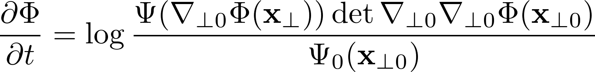
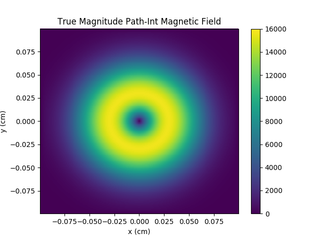
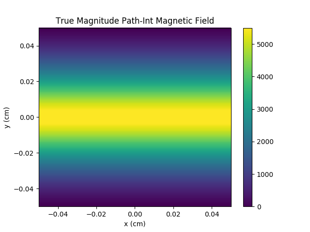

# PROBLEM Solver (PROton-imaged B-field nonLinear Extraction Module)

The PROBLEM Solver is an open source Python implementation of the proton
radiography reconstruction algorithm of Bott et al. (2017).
The project currently includes two example problems to demonstrate the
algorithm. When completed, it will provide tools to support 
reconstruction of magnetic fields from simulated and
experimental proton radiography data for high-energy laser experiments.

## Proton radiography

Proton radiography is an invaluable tool for gathering information about the 
strength and topology of magnetic fields in high-energy laser plasma experiments 
(Li et al. 2006). The diagnostic utilizes high-energy protons that travel 
through a magnetized plasma and whose paths are altered by the magnetic 
fields present in the plasma. After the interaction, the protons propagate 
to a screen where they impart an image, thereby recording information about 
magnetic field deflections. The image can then be analyzed after the experiment
to understand the structure of the magnetic field inside the plasma.


## The problem of reconstructing a magnetic field from a flux image

If the magnetic field strength is small enough in a plasma, 
the proton paths remain injective during proton radiography.
In this case, it can be shown that the path-integrated 
magnetic field may be reconstructed from the proton image 
(Graziani et al. 2016; Bott et al. 2017). 
In proton radiography, after the protons travel through the magnetic field,
the information regarding their deflections is imparted in the flux image.
We would like to transform the proton flux image back into information regarding
the proton deflections. 

In Bott et al. (2017), it is shown that reconstructing the magnetic field from a
proton image is equivalent to solving the following logarithmic parbolic
Monge-Amp&#232;re equation for the steady state solution of &#934;:

<p align="center">

</p>

PROBLEM transforms proton flux data into this Monge-Amp&#232;re problem and then
implements a solver to reconstruct the path-integrated magnetic field.

## Installation

Requirements:

* [`numpy`](http://www.numpy.org/)
* [`scipy`](https://www.scipy.org/)
* [`matplotlib`](https://matplotlib.org/)
* [`pradreader`](https://github.com/flash-center/PRadReader)

The requirements may be installed according to the directions on 
their webpages, or with any Python
package manager that supports them. For example, one could use `pip` to install
them as
 ```bash
pip install numpy scipy matplotlib
```
One could also use [Anaconda Python](https://anaconda.org/anaconda/python) to
install them as
```bash
conda install numpy scipy matplotlib
```

After installing the required packages, we may install PROBLEM as
```bash
git clone https://github.com/flash-center/PROBLEM.git
cd PROBLEM/
python setup.py install
```


## Example Problems

### Donut

The donut is an ellipsoidal blob of magnetic field,



To run this example problem,
```bash
cd ~/PROBLEM/examples/donut/
problem-solver input.txt --xstep .001 --ystep .001
```

**Note:** the `input.txt` file was generated by the
[`PRadReader`](https://github.com/flash-center/PRadReader) package by calling
```bash
pradreader flux.dat
```
and entering the relevant information at the prompts (located in `README.txt`).

Checkpoint files for every 1000 steps will be saved in the `solve/` directory.

Now, we run our script to plot the magnetic field strength at each step,
```bash
python plot_images.py
```
This script will save the image of the magnetic field at each time step to the
`images/` directory for viewing.

### Strip

The strip is an vertical strip of magnetic field, designed to test the
boundaries of the PROBLEM solver,



To run this example problem,
```bash
cd ~/PROBLEM/examples/strip/
problem-solver input.txt --xstep .0005 --ystep .0005
```

**Note:** the `input.txt` file was generated by the
[`PRadReader`](https://github.com/flash-center/PRadReader) package by calling
```bash
pradreader flux.dat
```
and entering the relevant information at the prompts (located in `README.txt`).

Checkpoint files for every 1000 steps will be saved in the `solve/` directory.

Now, we run our script to plot the magnetic field strength at each step,
```bash
python plot_images.py
```
This script will save the image of the magnetic field at each time step to the
`images/` directory for viewing.

